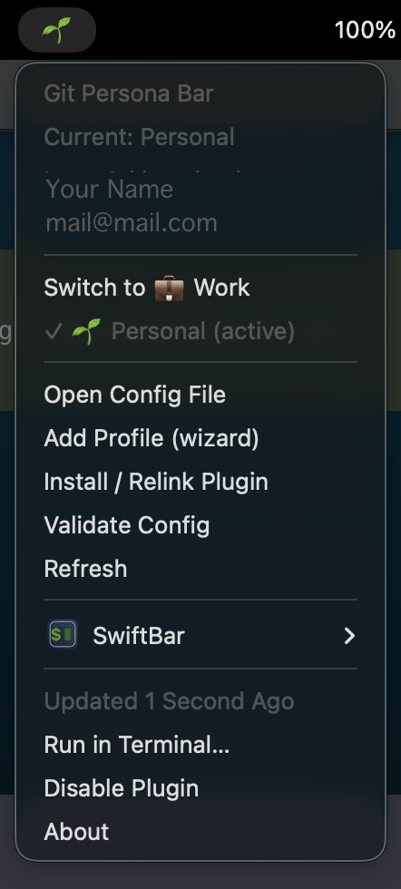

# Git Persona Bar

Catchy SwiftBar plugin to switch **Git + SSH identity** from your macOS menu bar.

- ✅ Up to **5 profiles**
- ✅ One-click switching in SwiftBar
- ✅ Updates global Git identity (`user.name`, `user.email`)
- ✅ Updates SSH identity per host in a **managed block** in `~/.ssh/config`
- ✅ Optional CLI wizard to add profiles quickly

---

## What it changes

When you switch profile, the plugin updates:

1. `git config --global user.name`
2. `git config --global user.email`
3. A managed block in `~/.ssh/config` for the configured host (placed at the **top** for priority):

```ssh
# >>> git-persona-bar:github.com >>>
Host github.com
  AddKeysToAgent yes
  UseKeychain yes
  IdentitiesOnly yes
  IdentityFile ~/.ssh/your_key
# <<< git-persona-bar:github.com <<<
```

It also runs:

- `ssh-add -D` (clear current loaded keys)
- `ssh-add <selected-key>`

---

## Requirements

- macOS
- [SwiftBar](https://swiftbar.app/)
- `bash`, `python3`, `git`, `ssh-add`

---

## Install

```bash
git clone https://github.com/IryArkhy/git-persona-bar.git ~/Pet/git-persona-bar
cd ~/Pet/git-persona-bar
./scripts/install.sh
```

Then in SwiftBar:

- Refresh plugins, or restart SwiftBar.

---

## How it looks



---

## Menu actions explained

These are the plugin actions you see in the dropdown:

- **Switch to <Profile>**
  - Applies the selected profile (`git config --global user.name/email`)
  - Updates managed `Host` block in `~/.ssh/config`
  - Reloads SSH key in agent (`ssh-add -D` + `ssh-add <key>`)

- **Open Config File**
  - Opens `~/.config/git-persona-bar/profiles.json` in your default editor

- **Add Profile (wizard)**
  - Opens a Terminal window/session intentionally
  - Asks a short interactive set of questions:
    - profile id
    - label
    - icon
    - git `user.name`
    - git `user.email`
    - SSH host (default: `github.com`)
    - SSH key path (e.g. `~/.ssh/id_ed25519_work`)
  - Writes the profile into `~/.config/git-persona-bar/profiles.json`
  - Optionally asks if you want to open the config file
  - **Safety**: no `sudo`, no key contents read/uploaded, no network calls

- **Install / Relink Plugin**
  - Opens Terminal and creates/refreshes a symlink from SwiftBar plugin directory to this repo script
  - Ensures script is executable
  - Useful after moving repo folders

- **Validate Config**
  - Opens Terminal and validates JSON structure and limits (max 5 profiles)
  - Prints clear errors if config is invalid

- **Refresh**
  - Tells SwiftBar to rerun the plugin immediately

> Note: menu items like **Run in Terminal…**, **Disable Plugin**, **About** are SwiftBar built-in actions, not provided by this plugin.

---

## Configure profiles

Config file:

```text
~/.config/git-persona-bar/profiles.json
```

Create/edit it manually from template:

```bash
mkdir -p ~/.config/git-persona-bar
cp ~/Pet/git-persona-bar/config/profiles.example.json ~/.config/git-persona-bar/profiles.json
open ~/.config/git-persona-bar/profiles.json
```

Or use the wizard:

```bash
~/Pet/git-persona-bar/scripts/add-profile.sh
```

### Remove a profile

1. Open config:

```bash
open ~/.config/git-persona-bar/profiles.json
```

2. Remove the profile object from the `profiles` array.
3. Save the file.
4. Refresh SwiftBar.

If the removed profile was active, reset plugin state:

```bash
rm -f ~/.config/git-persona-bar/state.json
```

Validate config after changes:

```bash
~/Pet/git-persona-bar/git-persona-bar.5s.sh validate
```

---

## Profile format

```json
{
  "profiles": [
    {
      "id": "work",
      "label": "Work",
      "icon": "💼",
      "git": {
        "name": "Your Name",
        "email": "you@company.com"
      },
      "ssh": {
        "host": "github.com",
        "identity_file": "~/.ssh/id_rsa_work"
      }
    }
  ]
}
```

### Limits

- Max profiles: **5**
- Profile IDs must be unique and use: `a-z A-Z 0-9 _ -`

---

## Notes & safety

- Do **not** commit private SSH keys.
- Use key paths only (e.g. `~/.ssh/id_ed25519_work`).
- Plugin creates timestamped backup copies of `~/.ssh/config` before updates.
- Existing `Host github.com` blocks can remain; the managed block is written at top so selected identity wins.
- You may see a one-time macOS notification permission prompt when profile switch notifications are shown.
- If config becomes invalid, plugin shows a warning icon and gives quick actions.

---

## Development

Run locally:

```bash
bash ./git-persona-bar.5s.sh
```

Validate config:

```bash
bash ./git-persona-bar.5s.sh validate
```

---

## License

MIT
